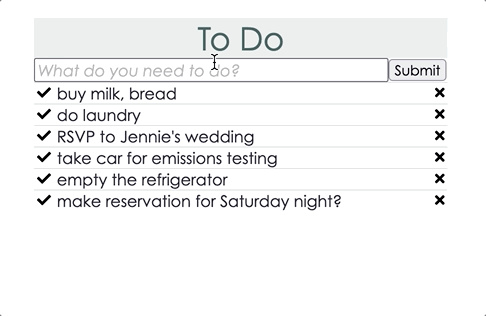

# **ToDo**

## **What it is**
A lightweight app that currently allows a user to add, cross off, and remove tasks. Future plans include more organizational functionality, as well as the ability to share tasks with other users.

The backend is built with Kotlin on Spring Boot, and the frontend is built with React.

## **How to use it**
- To run the backend, use `./gradlew bootrun`
- To run the frontend, use `npm start`
- To run migrations, use `./gradlew flywayMigrate`
